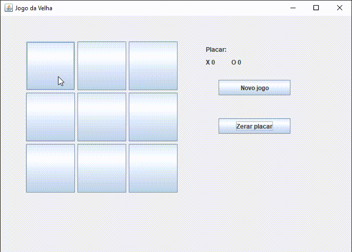

# JogoDaVelha
Este é um simples jogo da velha criado em JavaFX, que permite a dois jogadores jogarem o jogo clássico. O jogo possui um placar que mantém o registro das pontuações dos jogadores X e O.

## Como Jogar
- O jogo é jogado por dois jogadores, X e O, que marcam espaços em uma grade de 3 × 3 alternadamente.
- O jogador que conseguir colocar três de suas marcas em uma linha horizontal, vertical ou diagonal vence o jogo.
- Se nenhum dos jogadores conseguir três marcas em linha e todos os espaços da grade forem preenchidos, o jogo é empatado.
- O botão "Novo jogo" permite iniciar uma nova partida, enquanto "Zerar placar" limpa as pontuações dos jogadores.

## Classe Completa
A classe do jogo completo está incluída no arquivo Program.java.

## Executando Projeto
Basta executar o "Executavel Jogo da Velha.jar"

## Demostração:

